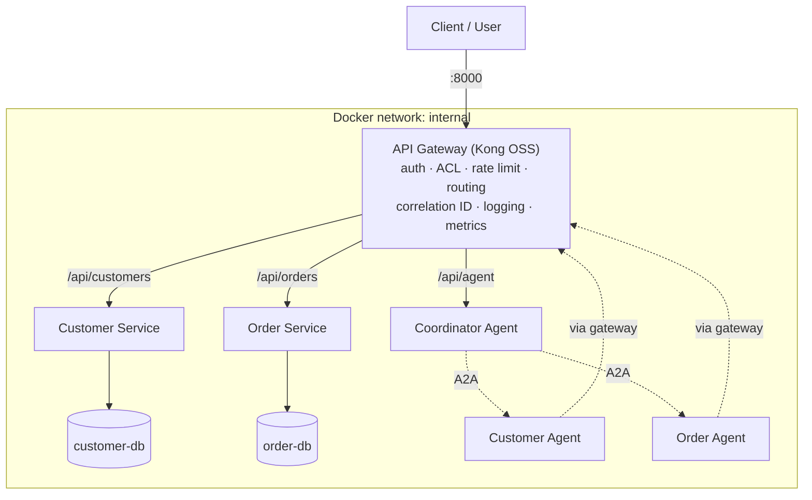

# ComCo Customer Service Integration Platform

Prototype integration platform demonstrating REST API design, API management, agentic API
consumption, Agent-to-Agent (A2A) communication, observability and containerized deployment.

> **Status:** Step 4 — APIs managed at the gateway; Customer and Order agents talk A2A and
> use the managed APIs. The Coordinator's planning arrives in Step 5 (see [Progress](#progress)).

## Architecture (current)



Only the gateway (port 8000) is published to the host. Services, databases and agents are on
the internal network, so external consumers can reach backend capabilities only through API
management. Agents also call the backend APIs *through the gateway* (see `docs/DECISIONS.md`, D7).

## Technology stack

| Concern | Choice |
|---|---|
| API gateway | Kong Gateway OSS 3.9 (DB-less, declarative `gateway/kong.yml`) |
| Backend services | Python 3.12 + FastAPI, psycopg 3 with connection pooling |
| Data stores | PostgreSQL 16, one instance per service |
| Agents | Custom Python, deterministic planner |
| Agent-to-Agent | A2A protocol v0.3 (Agent Cards, JSON-RPC `message/send`, task status), `libs/a2a_core` |
| Observability | Correlation ID + structured JSON logs; OpenTelemetry → Jaeger (Step 7) |
| Deployment | Docker Compose |

Reasons for each choice: [`docs/DECISIONS.md`](docs/DECISIONS.md).

## Repository layout

```
gateway/kong.yml              API gateway configuration (routes, plugins)
libs/common/                  Shared conventions: error format, correlation ID, JSON logs,
                              DB pool, managed-API client (agents -> gateway)
libs/a2a_core/                A2A protocol: Agent Card, tasks, JSON-RPC server/client, CLI
services/customer-service/    Customer REST API — app/ (code), db/ (schema + seed)
services/order-service/       Order REST API    — app/ (code), db/ (schema + seed)
agents/coordinator/           Coordinator Agent — exposed as the Agent API (planner: Step 5)
agents/customer-agent/        Customer Agent    — internal, A2A, skills over the Customer API
agents/order-agent/           Order Agent       — internal, A2A, skills over the Order API
docs/openapi/                 Exported OpenAPI 3.1 specs
docs/AGENTS.md                Agent architecture and A2A interaction
docs/DECISIONS.md             Architecture & technology decisions
scripts/                      Smoke test, A2A demo, OpenAPI export
tests/                        Automated tests (pytest): APIs, gateway, agents
```

## Running it

Prerequisites: Docker Desktop (or Docker Engine + Compose v2), `curl`, `bash`
(on Windows use Git Bash or WSL for the `.sh` scripts).

```bash
docker compose up --build -d     # build and start everything
docker compose ps                # all services should become "healthy"
./scripts/smoke-test.sh          # end-to-end check through the gateway
docker compose logs -f order-service   # structured JSON logs, one line per request
docker compose down              # stop   (add -v to also delete database data)
```

No configuration is needed; defaults live in `docker-compose.yml`. Each service creates its
schema and loads demo data on startup (idempotent, safe to restart). To override database
credentials, copy `.env.example` to `.env`.

### Interactive API docs (Swagger UI)

- Customer API: http://localhost:8000/api/customers/docs
- Order API: http://localhost:8000/api/orders/docs

The docs pages are public. To use "Try it out", click **Authorize** and enter an API key,
e.g. `demo-client-key`.

### API keys (development only)

Every request to an API must carry an `apikey` header. Consumers are defined in
`gateway/kong.yml`:

| Key | Consumer | Can call | Rate limit |
|---|---|---|---|
| `demo-client-key` | External application | Customer, Order, Agent APIs (read + write) | 20/min |
| `chat-frontend-key` | Chat UI | Agent API only | 30/min |
| `customer-agent-key` | Customer Agent | Customer API, read only | 300/min |
| `order-agent-key` | Order Agent | Order API, read only | 300/min |
| `test-runner-key` | Automated tests | Everything | 1000/min |
| `ratelimit-probe-key` | Rate-limit demo | Everything | 5/min |

Gateway responses: **401** missing/invalid key, **403** not allowed for this consumer,
**429** quota exceeded (see `Retry-After` and `X-RateLimit-*` headers), **413** body over 1 MB.

### Logs and metrics

```bash
docker compose logs -f gateway          # one JSON line per request: consumer, route, status, latencies
docker compose logs -f customer-service # service logs, same X-Correlation-ID
curl -s http://localhost:8100/metrics | grep kong_http_requests_total   # Prometheus metrics
```

### Agents (A2A)

The Customer and Order agents are internal. Talk to them with the A2A command-line client
from inside the coordinator container:

```bash
bash scripts/a2a-demo.sh         # discovery, skills, not-found, text routing, correlation
docker compose exec -T coordinator-agent python -m a2a_core.cli --brief send http://order-agent:8000 get_order order_id=O1001
```

How the agents and the A2A interaction work: [`docs/AGENTS.md`](docs/AGENTS.md).

### Automated tests

```bash
pip install -r tests/requirements.txt
pytest tests/ -v                 # everything (API + gateway tests need the stack running)
pytest tests/test_agents.py -v   # agents only — no Docker needed (fake gateway)
```

The tests create extra customers and orders (orders go to C005, so the demo customers stay as
documented). For a clean demo database: `docker compose down -v && docker compose up --build -d`.

## API overview

All paths below are as seen through the gateway. Full specs: `docs/openapi/*.yaml`.

| Method | Path | Purpose | Success | Errors |
|---|---|---|---|---|
| GET | `/api/customers` | List customers (`limit`, `offset`, `email`) | 200 | 400, 503 |
| GET | `/api/customers/{id}` | Get one customer | 200 | 400, 404, 503 |
| POST | `/api/customers` | Create a customer | 201 + `Location` | 400, 409, 503 |
| GET | `/api/orders` | List orders, newest first (`customer_id`, `status`, `limit`, `offset`) | 200 | 400, 503 |
| GET | `/api/orders/{id}` | Get one order with its items | 200 | 400, 404, 503 |
| POST | `/api/orders` | Place an order (status PENDING, total computed) | 201 + `Location` | 400, 503 |
| PATCH | `/api/orders/{id}` | Change status (enforced lifecycle) | 200 | 400, 404, 409, 503 |

**Latest order for a customer:** `GET /api/orders?customer_id=C001&limit=1`

**Error format** (every API, every error):

```json
{
  "error": {
    "code": "CUSTOMER_NOT_FOUND",
    "message": "Customer C999 was not found",
    "details": null,
    "correlation_id": "6f1c2a9e-..."
  }
}
```

**Demo data:** customers C001–C005 (C004 has no orders; C999 does not exist).
Orders O1001–O1007; O1001 is C001's oldest order (DELIVERED), O1006 is C001's latest (SHIPPED).

```bash
curl -i -H "apikey: demo-client-key" http://localhost:8000/api/customers/C001
curl -i -H "apikey: demo-client-key" http://localhost:8000/api/customers/C999      # 404 CUSTOMER_NOT_FOUND
curl -i -H "apikey: demo-client-key" "http://localhost:8000/api/orders?customer_id=C001&limit=1"  # latest order
curl -i -X POST http://localhost:8000/api/customers -H "apikey: demo-client-key" \
     -H "Content-Type: application/json" \
     -d '{"name":"Pim Rattanakul","email":"pim.r@example.com"}'                    # 201 + Location
curl -i http://localhost:8000/api/customers/C001                                    # 401 no key
curl -i -H "apikey: chat-frontend-key" http://localhost:8000/api/customers/C001     # 403 not allowed
```

## Progress

- [x] Step 0 — Stack chosen and justified (`docs/DECISIONS.md`)
- [x] Step 1 — Repo skeleton, Docker Compose, gateway routing
- [x] Step 2 — Customer & Order services with data, validation, error model, OpenAPI, tests
- [x] Step 3 — Gateway security: API keys, ACLs, rate limiting, logging, metrics
- [x] Step 4 — Customer & Order agents (Agent Cards, A2A tasks, managed-API tools)
- [ ] Step 5 — Coordinator agent: planning, discovery, delegation
- [ ] Step 6 — Failure handling (timeouts, unavailable backend/agent)
- [ ] Step 7 — Observability (OpenTelemetry + Jaeger)
- [ ] Step 8 — Tests and API collection
- [ ] Step 9 — Final documentation

## Assumptions

- Customer and order IDs follow the brief's examples: `C` + 3–6 digits, `O` + 4–8 digits.
- Single currency per order; THB by default.
- The Order Service does not verify that the customer exists when an order is created
  (keeps the services decoupled; see `docs/DECISIONS.md`, D10).
- Agents run on a private network and trust each other; only their calls to the business
  APIs are authenticated (at the gateway).

## Known limitations

- API keys are static and stored in `gateway/kong.yml` (development keys only).
- Errors generated by the gateway itself (401/403/429/413) use Kong's `{"message": ...}` body,
  not the platform error envelope (see `docs/DECISIONS.md`, D4).
- Rate-limit counters are local to one gateway node.
- Schema migrations run at service startup instead of through a migration tool.
- A2A is a subset of v0.3: synchronous `message/send` and `tasks/get` only (no streaming,
  push notifications, cancellation or multi-turn tasks). Tasks are kept in memory (last 1000).
- Agents understand requests through rules (IDs and keywords), not an LLM, so only
  supported phrasings work.
- Customers cannot be updated or deleted; orders cannot have their items changed
  (not needed for the assessment scenarios).
