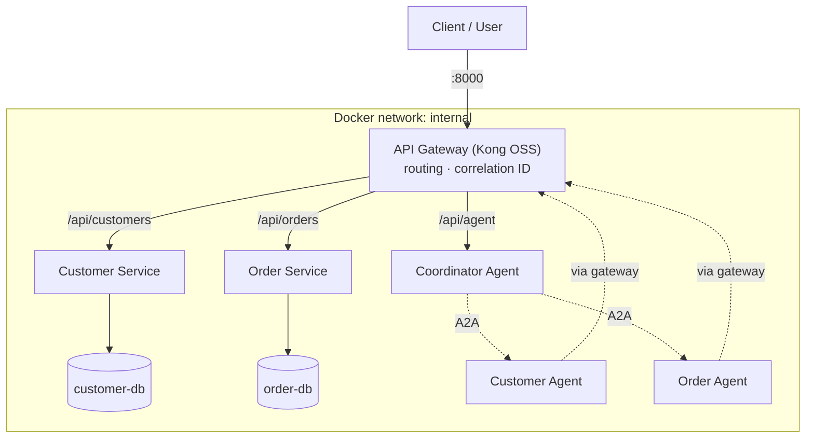

# ComCo Customer Service Integration Platform

Prototype integration platform demonstrating REST API design, API management, agentic API
consumption, Agent-to-Agent (A2A) communication, observability and containerized deployment.

> **Status:** Step 1 — skeleton. All components start and are routed through the API gateway.
> Business logic is added in later steps (see [Progress](#progress)).

## Architecture (current)



Only the gateway (port 8000) is published to the host. Services, databases and agents are on
the internal network, so external consumers can reach backend capabilities only through API
management. Agents also call the backend APIs *through the gateway* (see `docs/DECISIONS.md`, D7).

## Technology stack

| Concern | Choice |
|---|---|
| API gateway | Kong Gateway OSS 3.9 (DB-less, declarative `gateway/kong.yml`) |
| Backend services | Python 3.12 + FastAPI |
| Data stores | PostgreSQL 16, one instance per service |
| Agents | Custom Python, deterministic planner |
| Agent-to-Agent | A2A protocol concepts: Agent Cards + JSON-RPC tasks |
| Observability | Correlation ID + OpenTelemetry → Jaeger |
| Deployment | Docker Compose |

Reasons for each choice: [`docs/DECISIONS.md`](docs/DECISIONS.md).

## Repository layout

```
gateway/kong.yml              API gateway configuration (routes, plugins)
services/customer-service/    Customer REST API  (+ customer-db)
services/order-service/       Order REST API     (+ order-db)
agents/coordinator/           Coordinator Agent  — exposed as the Agent API
agents/customer-agent/        Customer Agent     — internal, A2A
agents/order-agent/           Order Agent        — internal, A2A
scripts/                      Smoke test / demo scripts
tests/                        Automated tests
docs/                         Decisions, architecture, agent & A2A descriptions
```

## Running it

Prerequisites: Docker Desktop (or Docker Engine + Compose v2), `curl`, `bash`.

```bash
docker compose up --build -d     # build and start everything
docker compose ps                # all services should become "healthy"
./scripts/smoke-test.sh          # check routing through the gateway
docker compose logs -f gateway   # watch gateway access logs
docker compose down              # stop   (add -v to also delete database data)
```

No configuration is needed; defaults live in `docker-compose.yml`. To override database
credentials, copy `.env.example` to `.env`.

Try it manually:

```bash
curl -i http://localhost:8000/api/customers   # note the X-Correlation-ID response header
curl -i http://localhost:8000/api/orders
```

## Progress

- [x] Step 0 — Stack chosen and justified (`docs/DECISIONS.md`)
- [x] Step 1 — Repo skeleton, Docker Compose, gateway routing
- [ ] Step 2 — Customer & Order services with data, validation, error model, OpenAPI
- [ ] Step 3 — Gateway security: API keys, ACLs, rate limiting, logging
- [ ] Step 4 — Customer & Order agents (Agent Cards, A2A tasks)
- [ ] Step 5 — Coordinator agent: planning, discovery, delegation
- [ ] Step 6 — Failure handling (timeouts, unavailable backend/agent)
- [ ] Step 7 — Observability (OpenTelemetry + Jaeger)
- [ ] Step 8 — Tests and API collection
- [ ] Step 9 — Final documentation

## Assumptions, limitations, incomplete functionality

To be completed as the build progresses (required by the brief).
