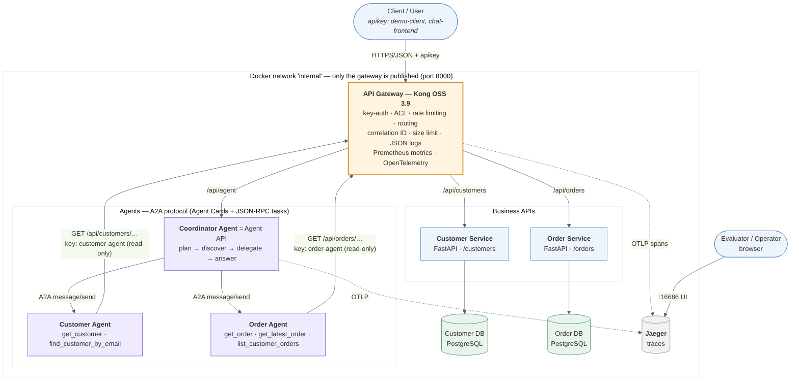

# ComCo Customer Service Integration Platform

A working prototype of an integration platform for ComCo's customer service: two independent
backend services behind an API gateway, an Agent API that answers natural-language questions,
and three AI agents that cooperate over the Agent-to-Agent (A2A) protocol. Everything is open
source and starts with one command.



**In one sentence:** a client asks *"Find customer C001 and tell me their latest order status"*;
Kong authenticates it and routes it to the **Coordinator Agent**, which plans the request,
discovers the **Customer Agent** and **Order Agent** from their Agent Cards, delegates A2A tasks
to them, and the agents fetch the data **through the same gateway** with their own read-only
keys. The answer is built only from what the APIs returned, and the whole journey is one trace
in Jaeger.

---

## Quick start

Prerequisites: **Docker Desktop** (or Docker Engine + Compose v2), **Python 3.8+**, `curl`.
On Windows, run the `.sh` scripts in **Git Bash**.

```bash
docker compose up --build -d            # build and start the 9 containers (first build: a few minutes)
docker compose ps                       # wait until all are "healthy"
bash scripts/smoke-test.sh              # end-to-end checks through the gateway: all PASS
python scripts/ask.py "Find customer C001 and tell me their latest order status"
python scripts/trace.py                 # the same request as one distributed trace
```

| URL | What |
|---|---|
| http://localhost:8000 | API gateway: the only public entry point |
| http://localhost:8000/api/agent/docs | Agent API (Swagger UI) |
| http://localhost:8000/api/customers/docs | Customer API (Swagger UI) |
| http://localhost:8000/api/orders/docs | Order API (Swagger UI) |
| http://localhost:16686 | Jaeger: distributed traces |
| http://localhost:8100/metrics | Gateway Prometheus metrics (localhost only) |

In Swagger UI, click **Authorize** and enter an API key (e.g. `demo-client-key`, or
`chat-frontend-key` for the Agent API).

---

## Deliverables

| # | Deliverable (brief §7) | Where |
|---|---|---|
| 1 | Source code | `services/`, `agents/`, `libs/` |
| 2 | Container / deployment configuration | [`docker-compose.yml`](docker-compose.yml), `*/Dockerfile` |
| 3 | API Gateway configuration | [`gateway/kong.yml`](gateway/kong.yml) |
| 4 | OpenAPI specification | [`docs/openapi/`](docs/openapi/): `customer-api.yaml`, `order-api.yaml`, `agent-api.yaml` |
| 5 | README | This file |
| 6 | Architecture diagram | [`docs/ARCHITECTURE.md`](docs/ARCHITECTURE.md), [`docs/diagrams/`](docs/diagrams/) (PNG, SVG, Mermaid source) |
| 7 | API test collection and automated tests | [`collections/comco-platform.postman_collection.json`](collections/) (33 requests, 81 assertions); [`tests/`](tests/) (122 pytest tests) |
| 8 | Setup and execution instructions | [Quick start](#quick-start), [Setup and execution](#setup-and-execution), [`docs/DEMO.md`](docs/DEMO.md) |
| 9 | Description of the Agent architecture | [`docs/AGENTS.md`](docs/AGENTS.md) §1–2, §4–5 |
| 10 | Description of the A2A interaction | [`docs/AGENTS.md`](docs/AGENTS.md) §3, §6; [sequence diagram](docs/diagrams/key-scenario.png) |

Further documentation: [`docs/DECISIONS.md`](docs/DECISIONS.md) (every decision with its
trade-off), [`docs/FAILURE-HANDLING.md`](docs/FAILURE-HANDLING.md),
[`docs/OBSERVABILITY.md`](docs/OBSERVABILITY.md).

---

## Demonstration scenarios

Every scenario from brief §5, with the command that shows it. Step-by-step runbook with what
to point out: [`docs/DEMO.md`](docs/DEMO.md).

| Scenario | Capability | Run | Result |
|---|---|---|---|
| Retrieve a customer | Single API / capability | `python scripts/ask.py "Show customer C001"` | 1 step, Customer Agent |
| Retrieve customer and latest order | Multiple API orchestration | `python scripts/ask.py "Show customer C001 and their latest order"` | 2 dependent steps, O1006 SHIPPED |
| Retrieve an unknown customer | Error / no-data handling | `python scripts/ask.py "Show customer C999"` | `not_found`, nothing invented |
| Retrieve an order through agent delegation | A2A delegation | `python scripts/ask.py "What is the status of order O1001?"` | A2A task to the Order Agent |
| Customer and order through multiple agents | Multi-agent coordination | `python scripts/ask.py "Find customer C001 and tell me their latest order status"` | Both agents, one answer |
| Backend or agent unavailable | Failure handling | `bash scripts/failure-demo.sh` | `partial` answers, retry, circuit breaker, recovery |
| Excessive API requests | Traffic management | `curl -i -H "apikey: ratelimit-probe-key" localhost:8000/api/customers/C001` ×6 | 429 + `Retry-After` |
| Unauthorized API request | API security | `curl -i localhost:8000/api/customers/C001` | 401 (403 with a key lacking permission) |
| Trace one complete request | Observability | `python scripts/trace.py` | One trace across all components |

---

## Architecture

Full description: [`docs/ARCHITECTURE.md`](docs/ARCHITECTURE.md). Key scenario, step by step:
[sequence diagram](docs/diagrams/key-scenario.png).

- **Kong** is the only published entry point. Services, databases and agents sit on a private
  Docker network with no published ports, so API management cannot be bypassed.
- **Database per service:** Customer and Order Services each own a PostgreSQL instance.
  "Customer + latest order" is composed by the agents, never by a cross-database join.
- **The Coordinator Agent is the Agent API.** It plans → discovers → delegates → answers.
- **Specialist agents are API consumers.** They call the business APIs through Kong with their
  own keys, read-only and limited to their own domain.
- **A2A** (v0.3, JSON-RPC over HTTP): Agent Cards for discovery; tasks with status
  `submitted → working → completed | failed | rejected`.
- **OpenTelemetry** traces from every component, including Kong, into Jaeger.

**Changes from the reference architecture** (details and reasons in `docs/ARCHITECTURE.md` §3):
agents reach the APIs *through the gateway*; the Agent API is the coordinator's HTTP interface;
A2A is direct agent-to-agent communication (a protocol, not a broker); observability is a
platform-wide component; read and write routes are split for least privilege.

---

## Technology choices

| Concern | Choice | Why (short; full reasoning in `docs/DECISIONS.md`) |
|---|---|---|
| API gateway | **Kong Gateway OSS 3.9**, DB-less | Auth, ACL, rate limiting, correlation ID, logging, metrics and tracing as built-in plugins; whole config in one versioned file |
| Backend services | **Python 3.12 + FastAPI** | OpenAPI generated from code, built-in validation, async I/O |
| Data stores | **PostgreSQL 16**, one per service | Database-per-service ownership boundary |
| Agents | **Custom Python, deterministic planner** | Reproducible, explainable, no model or paid API needed (allowed by the brief) |
| Agent-to-Agent | **A2A protocol v0.3**, implemented in `libs/a2a_core` | Open standard; small hand-written implementation keeps every concept visible |
| Resilience | Timeout budget, single-layer retries, circuit breaker (`libs/common/resilience.py`) | Controlled answers instead of hangs; no retry storms |
| Observability | **OpenTelemetry → Jaeger 2**, JSON logs, Kong Prometheus metrics | Vendor-neutral; one trace per request across all components |
| Tests | pytest, Postman collection (newman) | Unit, in-process multi-agent, and end-to-end through the gateway |
| Deployment | **Docker Compose** | One command, no manual configuration |

## Architecture decisions

The main ones, each explained with trade-offs and production alternatives in
[`docs/DECISIONS.md`](docs/DECISIONS.md):

1. **Agents are API consumers behind the gateway** (D7): same security, quotas and logging as any client.
2. **Least privilege per consumer and per operation** (D4): split read/write routes, ACL groups.
3. **"Not found" ≠ "failed"** (D6): a verified absence is a completed task; an outage is a failed
   task with an error code. This is what prevents the agents from fabricating answers.
4. **Answers composed from returned data only** (D5): template sentences, no free text generation.
5. **Discovery over configuration** (D5–D6): the coordinator knows agent addresses; skills come
   from Agent Cards at run time.
6. **Timeout budget, retries in one layer only, circuit breaker** (D11).
7. **One error envelope for all APIs** (D10) with a stable `code` and the correlation ID.
8. **Trace ID and correlation ID on everything** (D8): logs, spans, error bodies, responses.

---

## Setup and execution

### Start, check, stop

```bash
docker compose up --build -d      # start (Kong waits until services and agents are healthy)
docker compose ps                 # status and health
bash scripts/smoke-test.sh        # 22 checks: routing, security, Agent API, tracing, rate limit
docker compose logs -f gateway    # follow a component's logs (JSON)
docker compose down               # stop
docker compose down -v            # stop and delete the databases (clean demo data on next start)
```

No configuration is required. All settings have defaults in `docker-compose.yml`; database
credentials can be overridden by copying `.env.example` to `.env`. Each service creates its
schema and loads demo data on startup (idempotent).

### API keys (development keys, defined in `gateway/kong.yml`)

| Key | Consumer | Can call | Rate limit |
|---|---|---|---|
| `demo-client-key` | External application | Customer, Order, Agent APIs (read + write) | 20/min |
| `chat-frontend-key` | Chat UI | Agent API only | 30/min |
| `customer-agent-key` | Customer Agent | Customer API, read only | 300/min |
| `order-agent-key` | Order Agent | Order API, read only | 300/min |
| `test-runner-key` | Automated tests | Everything | 1000/min |
| `ratelimit-probe-key` | Rate-limit demo | Everything | 5/min |

Gateway responses: **401** missing or invalid key · **403** not allowed for this consumer ·
**429** quota exceeded (`Retry-After`, `X-RateLimit-*` headers) · **413** body over 1 MB.

### Tests

```bash
pip install -r tests/requirements.txt

pytest tests/ -v                       # all 122 tests (API and gateway tests need the stack running)
pytest tests/test_agents.py tests/test_coordinator.py tests/test_resilience.py tests/test_tracing.py -v
                                       # 77 agent/A2A/resilience/tracing tests, no Docker needed

npx newman run collections/comco-platform.postman_collection.json   # API collection (Node.js)
```

| Test file | Covers |
|---|---|
| `test_customer_api.py`, `test_order_api.py` | REST behaviour: validation, status codes, error envelope, lifecycle |
| `test_gateway.py` | 401 / 403 / 429 / 413, routing, correlation ID, Agent API through Kong, complete trace in Jaeger |
| `test_agents.py` | A2A protocol (Agent Card, tasks, JSON-RPC errors), skills, every failure mode against a fake gateway |
| `test_coordinator.py` | Planning, discovery, delegation, answers, partial / failed results, deadlines |
| `test_resilience.py` | Retry policy, circuit breaker, behaviour inside the platform |
| `test_tracing.py` | One request = one trace with the expected span tree |

The Postman collection can also be imported into Postman, Bruno or Insomnia and clicked through.
Tests create a few extra customers and orders (orders go to C005, so the demo customers stay as
documented); `docker compose down -v` resets the data.

### Demo and tooling scripts

| Script | Purpose |
|---|---|
| `scripts/smoke-test.sh` | Fast end-to-end health check through the gateway |
| `scripts/ask.py "<question>"` | Ask the Agent API; shows answer, reasoning, steps, trace link |
| `scripts/trace.py` | Send the key scenario and print its trace from Jaeger |
| `scripts/agent-demo.sh` | All agentic and A2A scenarios from the brief |
| `scripts/a2a-demo.sh` | Talk A2A directly to the specialist agents (discovery, tasks) |
| `scripts/failure-demo.sh` | Stop, pause and restore components one at a time |
| `scripts/export_openapi.py` | Regenerate `docs/openapi/*.yaml` from the running services |

### Troubleshooting

| Symptom | Fix |
|---|---|
| A container is not `healthy` | `docker compose logs <service>`; the databases take a few seconds on first start |
| Port 8000 or 16686 already in use | Stop the other program, or change the left side of `ports:` in `docker-compose.yml` |
| `$'\r': command not found` (Windows) | Line endings: `git config --global core.autocrlf input`, then re-checkout. `.gitattributes` keeps scripts LF |
| `python3` not found (Windows) | Use `python` |
| Demo values differ (e.g. C004 has orders) | Reset data: `docker compose down -v && docker compose up --build -d` |
| 429 during demos | The quota is per minute; wait for `Retry-After` |

---

## API overview

All paths as seen through the gateway. Full specifications: [`docs/openapi/`](docs/openapi/).

| Method | Path | Purpose | Success | Errors |
|---|---|---|---|---|
| GET | `/api/customers` | List customers (`limit`, `offset`, `email`) | 200 | 400, 503 |
| GET | `/api/customers/{id}` | Get one customer | 200 | 400, 404, 503 |
| POST | `/api/customers` | Create a customer | 201 + `Location` | 400, 409, 503 |
| GET | `/api/orders` | List orders, newest first (`customer_id`, `status`, `limit`, `offset`) | 200 | 400, 503 |
| GET | `/api/orders/{id}` | Get one order with its items | 200 | 400, 404, 503 |
| POST | `/api/orders` | Place an order (status PENDING, total computed) | 201 + `Location` | 400, 503 |
| PATCH | `/api/orders/{id}` | Change status (enforced lifecycle) | 200 | 400, 404, 409, 503 |
| POST | `/api/agent/query` | Ask in natural language: `{"query": "..."}` | 200 | 400, 503 |
| GET | `/api/agent/agents` | Agents and skills discovered from Agent Cards | 200 | — |

Latest order of a customer: `GET /api/orders?customer_id=C001&limit=1`.
Error format (every service, every error):

```json
{"error": {"code": "CUSTOMER_NOT_FOUND", "message": "Customer C999 was not found",
           "details": null, "correlation_id": "6f1c2a9e-…"}}
```

**Demo data:** customers C001–C005 (C004 has no orders; C999 does not exist).
Orders O1001–O1007: O1001 is C001's oldest order (DELIVERED), O1006 C001's latest (SHIPPED).

## Repository layout

```
gateway/kong.yml              API gateway configuration: consumers, routes, plugins
services/customer-service/    Customer REST API: app/ (code), db/ (schema + seed)
services/order-service/       Order REST API:    app/ (code), db/ (schema + seed)
agents/coordinator/           Coordinator Agent = Agent API: planner, discovery, executor, answer
agents/customer-agent/        Customer Agent (A2A): skills over the Customer API
agents/order-agent/           Order Agent (A2A): skills over the Order API
libs/a2a_core/                A2A protocol: Agent Card, tasks, JSON-RPC server + client, CLI
libs/common/                  Shared: error envelope, correlation ID, JSON logs, DB pool, managed-API
                              client, retry + circuit breaker, OpenTelemetry tracing
collections/                  Postman collection (API tests for all scenarios)
tests/                        pytest suites
scripts/                      Smoke test, demos, ask.py, trace.py, OpenAPI export
docs/                         Architecture, agents & A2A, decisions, failure handling,
                              observability, demo runbook, OpenAPI specs, diagrams
docker-compose.yml            The whole platform: 9 containers
```

---

## Assumptions

- Customer and order IDs follow the brief's examples: `C` + 3–6 digits, `O` + 4–8 digits.
- Orders have one currency (THB by default). Money is handled as exact decimals.
- The Order Service does not verify that a customer exists when an order is created. This keeps
  the services decoupled at write time (D10). The Coordinator checks existence when answering.
- "Latest order" means the most recently **created** order.
- Agents run on a private network and trust each other. Their calls to the business APIs are
  authenticated and authorised at the gateway.
- Requests are in English and identify customers by ID (`C001`) or email, and orders by ID (`O1001`).
- The platform runs locally for evaluation (single host, plain HTTP).

## Known limitations

- **Static API keys** stored in `gateway/kong.yml` (development keys). Production: OAuth 2.0
  client credentials / JWT, keys in a secrets manager.
- **Gateway-generated errors** (401/403/429/413/502/504) use Kong's `{"message": …}` body, not the
  platform's `{"error": {…}}` envelope; clients should branch on the HTTP status for those.
- **Rule-based language understanding:** only supported phrasings work; anything else is
  answered as `unsupported` with examples.
- **State is per process:** rate-limit counters, circuit breakers and A2A tasks (in memory, last
  1000) are not shared between replicas.
- **Jaeger keeps traces in memory** (lost on restart) and samples 100 % of requests.
- **Schema migrations** run at service startup rather than through a migration tool.
- **Single replica** of everything; no TLS on the local network.

## Incomplete functionality

Deliberately out of scope for the prototype; each would be the next step:

- **LLM-based planning.** The coordinator's planner is rule-based. Next: an LLM (e.g. Ollama)
  producing the same structured plan, validated against the discovered skills; execution and
  answer composition stay deterministic.
- **A2A features beyond the core:** no streaming (`message/stream`), push notifications, task
  cancellation or multi-turn (`input-required`) conversations; no authentication between agents
  (mTLS or signed tokens in production).
- **Uniform error envelope at the gateway:** Kong's custom error templates were not configured,
  because they could not be verified for plugin errors in this setup (see D11).
- **CRUD completeness:** customers cannot be updated or deleted; order items cannot be changed
  after creation (not needed for the scenarios).
- **Monitoring dashboards:** Kong exposes Prometheus metrics, but no Prometheus/Grafana is
  deployed. Logs are not shipped to a log store.
- **CI/CD pipeline:** tests run locally; no GitHub Actions workflow is included.
