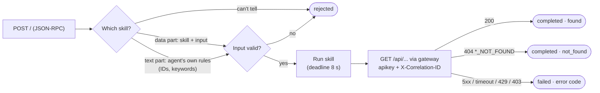
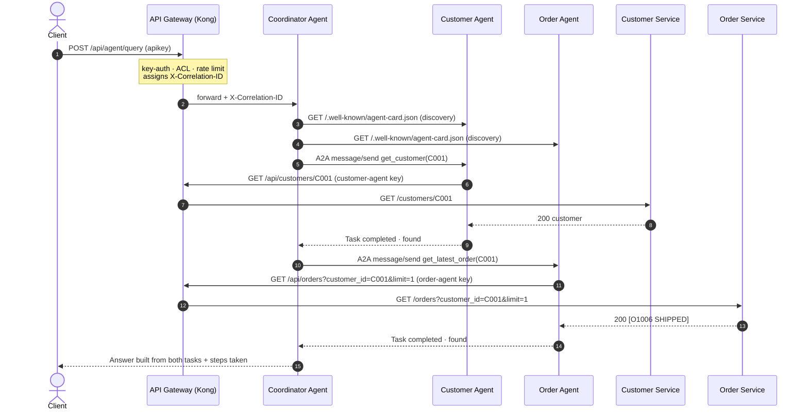

# Agent Architecture and A2A Interaction

> Covers deliverables 9 ("Description of the Agent architecture") and 10 ("Description of the
> A2A interaction"). Status: Customer Agent and Order Agent implemented (Step 4). The
> Coordinator Agent's planning and delegation are added in Step 5.

## 1. The agents

| Agent | Role | Skills | Reaches | Gateway consumer |
|---|---|---|---|---|
| **Coordinator Agent** | Entry point for natural-language requests (`POST /api/agent/query`). Plans, delegates over A2A, combines results. | — (it is the A2A *client*) | Customer Agent, Order Agent (A2A) | — (called *by* clients through the gateway) |
| **Customer Agent** | Specialist for customer information | `get_customer`, `find_customer_by_email` | Customer API via the gateway | `customer-agent`: Customer API, **read only** |
| **Order Agent** | Specialist for orders and order status | `get_order`, `get_latest_order`, `list_customer_orders` | Order API via the gateway | `order-agent`: Order API, **read only** |

Design principles:

- **Agents use managed APIs, never databases.** Specialist agents call the same API gateway
  as any external consumer, with their own API key. Their traffic is authenticated,
  authorised, rate-limited and logged like everyone else's.
- **Least privilege.** Each agent can only *read* its own domain. The gateway enforces it:
  the Order Agent gets 403 on the Customer API and on any write. An agent can't modify
  data even if its logic goes wrong.
- **One domain per agent.** The Order Agent knows orders, not customers. For an unknown
  customer it can only say "no orders found"; confirming the customer exists is the
  Customer Agent's job. The coordinator combines both.
- **Never fabricate.** Every answer is built only from API data. "Doesn't exist" and
  "couldn't check" are reported differently (section 4).
- **Deterministic.** Skill selection uses explicit rules, not an LLM, so every demo run is
  reproducible and needs no model or paid API (allowed by the brief). An LLM-based planner
  could replace the rules behind the same interface.

## 2. A2A protocol implementation

Agents talk to each other with the **Agent2Agent (A2A) protocol, v0.3, JSON-RPC 2.0 over
HTTP**. It is implemented in `libs/a2a_core/` (~400 lines) rather than with the `a2a-sdk`
package, to keep every protocol concept visible and explainable. The wire format follows the
specification.

| A2A concept | How it's implemented |
|---|---|
| **Discovery & capabilities** | Each agent publishes an **Agent Card** at `GET /.well-known/agent-card.json` (also the older `/.well-known/agent.json`): name, description, endpoint URL, protocol version, capabilities and a list of **skills** with descriptions, examples and an input JSON schema (`inputSchema`, a small extension to the spec). |
| **Task delegation** | The client sends JSON-RPC `message/send` to the agent's URL. The message's parts say what to do: a `data` part `{"skill": "get_order", "input": {"order_id": "O1001"}}`, or a plain `text` part that the agent routes itself. |
| **Task execution** | The agent creates a **Task**, validates the input against the skill's schema, runs the skill with a deadline (`SKILL_TIMEOUT_SECONDS`, default 8 s), and calls the managed API with a per-call timeout (`API_TIMEOUT_SECONDS`, default 5 s). |
| **Task result / status** | The response is the Task: `status.state` (`submitted → working → completed / failed / rejected`), the transition history in `metadata.statusHistory`, an agent message explaining the result, and **artifacts** holding the structured data plus a one-sentence summary. `tasks/get` returns a task again by ID. |
| **Correlation** | The `X-Correlation-ID` header travels with every A2A call and every API call, and is stored on the task (`metadata.correlationId`). |

Not implemented (documented limitations): streaming (`message/stream`), push notifications,
task cancellation, multi-turn `input-required` conversations, authentication between agents
(agents sit on a private network; production would add mTLS or signed tokens).

### Example exchange

Request from the coordinator to the Order Agent:

```json
{
  "jsonrpc": "2.0", "id": "7f3c…", "method": "message/send",
  "params": {
    "message": {
      "kind": "message", "role": "user", "messageId": "b1e2…",
      "parts": [{ "kind": "data", "data": { "skill": "get_latest_order", "input": { "customer_id": "C001" } } }]
    }
  }
}
```

Response (abridged):

```json
{
  "jsonrpc": "2.0", "id": "7f3c…",
  "result": {
    "kind": "task", "id": "c142…", "contextId": "9d0a…",
    "status": {
      "state": "completed",
      "message": { "role": "agent", "parts": [{ "kind": "text",
        "text": "Latest order: Order O1006 for customer C001 is SHIPPED. Total 5480.00 THB, 2 item(s), placed 2026-10-03, last updated 2026-10-05." }] }
    },
    "artifacts": [{
      "name": "latest_order",
      "parts": [
        { "kind": "data", "data": { "outcome": "found", "customer_id": "C001", "total_orders": 3,
                                    "order": { "order_id": "O1006", "status": "SHIPPED", "…": "…" } } },
        { "kind": "text", "text": "Latest order: Order O1006 for customer C001 is SHIPPED. …" }
      ]
    }],
    "metadata": {
      "agent": "Order Agent", "skill": "get_latest_order", "correlationId": "6f1c…",
      "statusHistory": [{ "state": "submitted" }, { "state": "working" }, { "state": "completed" }],
      "durationMs": 14.2
    }
  }
}
```

## 3. Inside a specialist agent



**Tool selection.** For structured requests the caller names the skill. For plain text the
agent chooses: the Order Agent picks `get_order` when it sees an order ID, `get_latest_order`
when it sees a customer ID plus "latest/last/recent", and `list_customer_orders` for a customer
ID alone. Anything else is rejected with the list of available skills.

## 4. Outcome semantics: how "no fabrication" is enforced

| Situation | Task state | Result | What a caller may say |
|---|---|---|---|
| Data exists | `completed` | `outcome: found` + data | The facts in the data |
| API says it doesn't exist (404 `CUSTOMER_NOT_FOUND`) | `completed` | `outcome: not_found`, data `null` | "Customer C999 was not found." |
| Customer has no orders | `completed` | `outcome: not_found`, `total_orders: 0` | "No orders were found for C004." |
| Invalid input / unknown skill | `rejected` | error `INVALID_INPUT`, `UNKNOWN_SKILL`, `UNSUPPORTED_REQUEST` | The request couldn't be processed |
| Backend down (5xx / 502 / 503) | `failed` | error `BACKEND_UNAVAILABLE`, retryable | "Order information is currently unavailable." |
| API timed out | `failed` | error `UPSTREAM_TIMEOUT`, retryable | same |
| Gateway unreachable | `failed` | error `GATEWAY_UNREACHABLE`, retryable | same |
| Quota exhausted (429) | `failed` | error `RATE_LIMITED`, retryable | same |
| Agent's key/permission refused (401/403) | `failed` | error `ACCESS_DENIED`, not retryable | Configuration problem |
| Skill exceeded its deadline | `failed` | error `SKILL_TIMEOUT`, retryable | same |
| Agent itself unreachable | — (no task) | client error `AGENT_UNREACHABLE` / `AGENT_TIMEOUT` | "The Order Agent is unavailable." |

A failed task never carries artifacts, so there is no partial data to misreport. The key
distinction is **not_found** (a real, verified answer) vs **failed** (we don't know).
Treating a backend outage as "not found" would itself be fabrication.

## 5. End-to-end flow (key scenario)

"Find customer C001 and tell me their latest order status." Coordinator logic arrives in Step 5.



The same `X-Correlation-ID` appears in the gateway log, both agents' logs and both services'
logs.

## 6. Trying it (Step 4)

The specialist agents are internal, so the A2A command-line client runs inside the
coordinator container:

```bash
bash scripts/a2a-demo.sh     # discovery, skills, not-found, text routing, invalid input, correlation

# individual calls
docker compose exec -T coordinator-agent python -m a2a_core.cli discover http://order-agent:8000
docker compose exec -T coordinator-agent python -m a2a_core.cli --brief send http://order-agent:8000 get_order order_id=O1001
docker compose exec -T coordinator-agent python -m a2a_core.cli --brief ask  http://order-agent:8000 "latest order for C001"
```

Unit tests (no Docker): `pytest tests/test_agents.py -v`. They run both agents against a fake
gateway that injects every failure mode in the table above.
