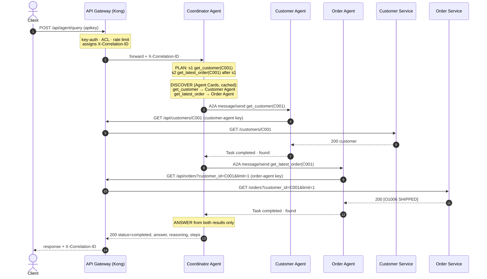

# Agent Architecture and A2A Interaction

> Covers deliverables 9 ("Description of the Agent architecture") and 10 ("Description of the
> A2A interaction").

## 1. The agents

| Agent | Role | Skills | Reaches | Gateway consumer |
|---|---|---|---|---|
| **Coordinator Agent** | Entry point for natural-language requests (`POST /api/agent/query`). Plans, discovers, delegates over A2A, composes the answer. | `answer_query` (its own Agent Card, so it can be delegated to as well) | Customer Agent, Order Agent (A2A) | — (called *by* clients through the gateway) |
| **Customer Agent** | Specialist for customer information | `get_customer`, `find_customer_by_email` | Customer API via the gateway | `customer-agent`: Customer API, **read only** |
| **Order Agent** | Specialist for orders and order status | `get_order`, `get_latest_order`, `list_customer_orders` | Order API via the gateway | `order-agent`: Order API, **read only** |

Design principles:

- **Agents use managed APIs, never databases.** Specialist agents call the same API gateway
  as any external consumer, with their own API key. Their traffic is authenticated,
  authorised, rate-limited and logged like everyone else's.
- **Least privilege.** Each agent can only *read* its own domain. The gateway enforces it:
  the Order Agent gets 403 on the Customer API and on any write. An agent can't modify
  data even if its logic goes wrong.
- **One domain per agent.** The Order Agent knows orders, not customers. For an unknown
  customer it can only say "no orders found"; confirming the customer exists is the
  Customer Agent's job. The coordinator combines both.
- **Never fabricate.** Every answer is built only from API data. "Doesn't exist" and
  "couldn't check" are reported differently (section 4).
- **Deterministic.** Skill selection uses explicit rules, not an LLM, so every demo run is
  reproducible and needs no model or paid API (allowed by the brief). An LLM-based planner
  could replace the rules behind the same interface.

## 2. The Coordinator Agent

Every request to `POST /api/agent/query` goes through four stages, each in its own module
under `agents/coordinator/coordinator/`:

| Stage | Module | What happens |
|---|---|---|
| **1. Plan** | `planner.py` | Reads the request and decides which **skills** are needed, with inputs and dependencies. No network calls. |
| **2. Discover** | `discovery.py` | Finds which agent offers each skill by reading the agents' **Agent Cards**. The coordinator is configured with agent *addresses* only. |
| **3. Delegate** | `executor.py` | Sends each step to its agent as an **A2A task**. Independent steps run in parallel; dependent steps wait. |
| **4. Answer** | `answer.py` | Builds the reply **only from the agents' results**, using fixed sentence templates, and sets the overall status. |

### Planning rules (deterministic)

| The request mentions | Plan |
|---|---|
| a customer ID (`C001`) | `get_customer` |
| … plus "latest / last / recent order", or "order status" without an order ID | … then `get_latest_order` **after** the customer is found |
| … plus "orders" / "order history" | … then `list_customer_orders` after the customer is found |
| an order ID (`O1001`) | `get_order` |
| an email address (no customer ID) | `find_customer_by_email`; with order wording, then `get_latest_order` using the **customer ID returned by step 1** |
| none of these | no plan → status `unsupported`, no agent is called, examples are suggested |

At most 5 entities per request (bounded fan-out). The plan and the reasons for it are returned
in the response (`reasoning`, `plan`), so the decision-making is visible.

**Why the order lookup waits for the customer:** for "C999 and their latest order" the
coordinator first confirms the customer exists. If not, the order step is *skipped*: no
pointless call, and no risk of reporting orders for a customer who doesn't exist.

### Overall status and HTTP code

| Status | Meaning | HTTP |
|---|---|---|
| `completed` | Everything asked was answered (including a verified "they have no orders") | 200 |
| `not_found` | What the user asked about (customer / order / email) does not exist | 200 |
| `partial` | Some information retrieved, some unavailable (agent or backend down, timeout) | 200 |
| `failed` | Nothing could be retrieved because of failures | **503** |
| `unsupported` | Request not understood; no agent was called | 200 |

`failed` returns 503 (same body) so gateway metrics and monitoring see the outage; the other
statuses are valid answers.

### Response (abridged)

```json
{
  "query": "Find customer C001 and tell me their latest order status",
  "status": "completed",
  "answer": "Customer C001 is Somchai Jaidee (GOLD tier, somchai.j@example.com). Their latest order is O1006, with status SHIPPED (total 5480.00 THB, placed 2026-10-03, last updated 2026-10-05).",
  "reasoning": [
    "Customer ID C001 mentioned -> skill get_customer.",
    "Order information for C001 requested -> skill get_latest_order, only after C001 is confirmed to exist."
  ],
  "plan":  [{"id": "s1", "skill": "get_customer", "input": {"customer_id": "C001"}, "depends_on": []},
            {"id": "s2", "skill": "get_latest_order", "input": {"customer_id": "C001"}, "depends_on": ["s1"]}],
  "steps": [{"id": "s1", "skill": "get_customer", "agent": "Customer Agent", "state": "completed", "outcome": "found", "task_id": "…"},
            {"id": "s2", "skill": "get_latest_order", "agent": "Order Agent", "state": "completed", "outcome": "found", "task_id": "…"}],
  "data": {"s1": {"customer": {"…": "…"}}, "s2": {"order": {"order_id": "O1006", "status": "SHIPPED", "…": "…"}}},
  "correlation_id": "key-scenario-001",
  "duration_ms": 107.4
}
```

### Discovery and recovery

- On startup the coordinator fetches every Agent Card in `AGENT_URLS` and builds a
  skill → agent registry. `GET /api/agent/agents` shows it.
- An agent that is down at startup is simply missing; the coordinator still starts.
- The registry refreshes every 60 s, immediately (max once per 5 s) when a needed skill has
  no agent, and after any failed call to an agent. A restarted agent is picked up again without
  restarting the coordinator.

### Timeout budget

Each layer gives up before the layer above it, so the caller always gets a controlled answer
instead of a gateway timeout:

```
gateway->backend 4 s < API call 5 s < agent task 8 s < A2A call 10 s < whole query 12 s < gateway->coordinator 15 s
```

Retries, circuit breakers and the full failure matrix: [`FAILURE-HANDLING.md`](FAILURE-HANDLING.md).

## 3. A2A protocol implementation

Agents talk to each other with the **Agent2Agent (A2A) protocol, v0.3, JSON-RPC 2.0 over
HTTP**. It is implemented in `libs/a2a_core/` (~400 lines) rather than with the `a2a-sdk`
package, to keep every protocol concept visible and explainable. The wire format follows the
specification.

| A2A concept | How it's implemented |
|---|---|
| **Discovery & capabilities** | Each agent publishes an **Agent Card** at `GET /.well-known/agent-card.json` (also the older `/.well-known/agent.json`): name, description, endpoint URL, protocol version, capabilities and a list of **skills** with descriptions, examples and an input JSON schema (`inputSchema`, a small extension to the spec). |
| **Task delegation** | The client sends JSON-RPC `message/send` to the agent's URL. The message's parts say what to do: a `data` part `{"skill": "get_order", "input": {"order_id": "O1001"}}`, or a plain `text` part that the agent routes itself. |
| **Task execution** | The agent creates a **Task**, validates the input against the skill's schema, runs the skill with a deadline (`SKILL_TIMEOUT_SECONDS`, default 8 s), and calls the managed API with a per-call timeout (`API_TIMEOUT_SECONDS`, default 5 s). |
| **Task result / status** | The response is the Task: `status.state` (`submitted → working → completed / failed / rejected`), the transition history in `metadata.statusHistory`, an agent message explaining the result, and **artifacts** holding the structured data plus a one-sentence summary. `tasks/get` returns a task again by ID. |
| **Correlation** | The `X-Correlation-ID` header travels with every A2A call and every API call, and is stored on the task (`metadata.correlationId`). |

Not implemented (documented limitations): streaming (`message/stream`), push notifications,
task cancellation, multi-turn `input-required` conversations, authentication between agents
(agents sit on a private network; production would add mTLS or signed tokens).

### Example exchange

Request from the coordinator to the Order Agent:

```json
{
  "jsonrpc": "2.0", "id": "7f3c…", "method": "message/send",
  "params": {
    "message": {
      "kind": "message", "role": "user", "messageId": "b1e2…",
      "parts": [{ "kind": "data", "data": { "skill": "get_latest_order", "input": { "customer_id": "C001" } } }]
    }
  }
}
```

Response (abridged):

```json
{
  "jsonrpc": "2.0", "id": "7f3c…",
  "result": {
    "kind": "task", "id": "c142…", "contextId": "9d0a…",
    "status": {
      "state": "completed",
      "message": { "role": "agent", "parts": [{ "kind": "text",
        "text": "Latest order: Order O1006 for customer C001 is SHIPPED. Total 5480.00 THB, 2 item(s), placed 2026-10-03, last updated 2026-10-05." }] }
    },
    "artifacts": [{
      "name": "latest_order",
      "parts": [
        { "kind": "data", "data": { "outcome": "found", "customer_id": "C001", "total_orders": 3,
                                    "order": { "order_id": "O1006", "status": "SHIPPED", "…": "…" } } },
        { "kind": "text", "text": "Latest order: Order O1006 for customer C001 is SHIPPED. …" }
      ]
    }],
    "metadata": {
      "agent": "Order Agent", "skill": "get_latest_order", "correlationId": "6f1c…",
      "statusHistory": [{ "state": "submitted" }, { "state": "working" }, { "state": "completed" }],
      "durationMs": 14.2
    }
  }
}
```

## 4. Inside a specialist agent


**Tool selection.** For structured requests the caller names the skill. For plain text the
agent chooses: the Order Agent picks `get_order` when it sees an order ID, `get_latest_order`
when it sees a customer ID plus "latest/last/recent", and `list_customer_orders` for a customer
ID alone. Anything else is rejected with the list of available skills.

## 5. Outcome semantics: how "no fabrication" is enforced

| Situation | Task state | Result | What a caller may say |
|---|---|---|---|
| Data exists | `completed` | `outcome: found` + data | The facts in the data |
| API says it doesn't exist (404 `CUSTOMER_NOT_FOUND`) | `completed` | `outcome: not_found`, data `null` | "Customer C999 was not found." |
| Customer has no orders | `completed` | `outcome: not_found`, `total_orders: 0` | "No orders were found for C004." |
| Invalid input / unknown skill | `rejected` | error `INVALID_INPUT`, `UNKNOWN_SKILL`, `UNSUPPORTED_REQUEST` | The request couldn't be processed |
| Backend down (5xx / 502 / 503), after one retry | `failed` | error `BACKEND_UNAVAILABLE`, retryable | "Order information is currently unavailable." |
| API timed out (504 / no response) | `failed` | error `UPSTREAM_TIMEOUT`, retryable | same |
| Circuit open after repeated failures | `failed` (immediately, no API call) | error `CIRCUIT_OPEN`, retryable | same |
| Gateway unreachable | `failed` | error `GATEWAY_UNREACHABLE`, retryable | same |
| Quota exhausted (429) | `failed` | error `RATE_LIMITED`, retryable | same |
| Agent's key/permission refused (401/403) | `failed` | error `ACCESS_DENIED`, not retryable | Configuration problem |
| Skill exceeded its deadline | `failed` | error `SKILL_TIMEOUT`, retryable | same |
| Agent itself unreachable | — (no task) | client error `AGENT_UNREACHABLE` / `AGENT_TIMEOUT` | "The Order Agent is unavailable." |

A failed task never carries artifacts, so there is no partial data to misreport. The key
distinction is **not_found** (a real, verified answer) vs **failed** (we don't know).
Treating a backend outage as "not found" would itself be fabrication.

## 6. End-to-end flow (key scenario)

"Find customer C001 and tell me their latest order status."



The same `X-Correlation-ID` appears in the gateway log, both agents' logs and both services'
logs.

## 7. Trying it

```bash
bash scripts/agent-demo.sh      # the brief's agent scenarios through the gateway, plus a trace
python scripts/ask.py "Find customer C001 and tell me their latest order status"
python scripts/ask.py --json "Show customer C999"      # full response
bash scripts/a2a-demo.sh        # talk A2A to the specialist agents directly
```

Failure handling:

```bash
docker compose stop order-agent       # or order-service
python scripts/ask.py "Find customer C001 and tell me their latest order status"   # -> partial
docker compose start order-agent

docker compose stop customer-agent
python scripts/ask.py "Show customer C001"                                          # -> 503 failed
docker compose start customer-agent
```

Tests without Docker: `pytest tests/test_agents.py tests/test_coordinator.py -v`. All three
agents run in-process on a simulated network that can take an agent offline, with fake gateways
that inject backend failures.
