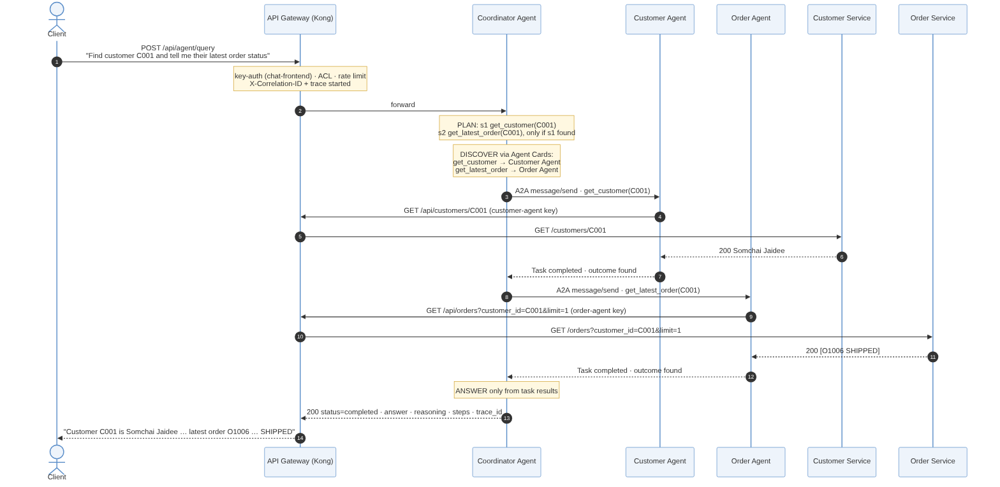

# Architecture

*Source: [`diagrams/architecture.mmd`](diagrams/architecture.mmd) (Mermaid). Also as [SVG](diagrams/architecture.svg).*

## 1. Components

| Component | Technology | Responsibility | Reachable from the host? |
|---|---|---|---|
| **API Gateway** | Kong Gateway OSS 3.9, DB-less (`gateway/kong.yml`) | The single entry point: authentication, access control, rate limiting, routing, correlation ID, request size limit, logging, metrics, tracing | **Yes**, port 8000 (APIs), localhost-only 8001 (admin, read) and 8100 (metrics) |
| **Customer Service** | Python 3.12, FastAPI | Customer REST API, owns `customer-db` | No |
| **Order Service** | Python 3.12, FastAPI | Order REST API, owns `order-db` | No |
| **Customer DB / Order DB** | PostgreSQL 16 (one instance each) | Database per service | No |
| **Coordinator Agent** | Python, FastAPI, `libs/a2a_core` | The **Agent API**: plans requests, discovers agents, delegates over A2A, composes answers | Only via the gateway (`/api/agent`) |
| **Customer Agent** | Python, `libs/a2a_core` | A2A agent with customer skills; calls the Customer API via the gateway | No |
| **Order Agent** | Python, `libs/a2a_core` | A2A agent with order skills; calls the Order API via the gateway | No |
| **Jaeger** | Jaeger 2.21 all-in-one | Receives OpenTelemetry spans from every component; trace UI | Localhost-only 16686 (UI) |

Everything runs on one private Docker network (`internal`). The backends, databases and agents
publish **no ports**, so the API management layer cannot be bypassed.

## 2. Request flow: the key scenario

*Source: [`diagrams/key-scenario.mmd`](diagrams/key-scenario.mmd).*

1. The client calls `POST /api/agent/query` with its API key.
2. Kong authenticates it (`chat-frontend`), checks the ACL and rate limit, adds `X-Correlation-ID`,
   starts the trace and forwards the request to the Coordinator.
3. The Coordinator **plans** (`get_customer`, then `get_latest_order` if the customer exists) and
   **discovers** which agent offers each skill from their Agent Cards.
4. It **delegates** `get_customer` to the Customer Agent (A2A `message/send`). The agent calls
   `GET /api/customers/C001` **through Kong** with its own read-only key; Kong forwards to the
   Customer Service; the result returns as a completed A2A task.
5. Because the customer was found, it delegates `get_latest_order` to the Order Agent, which
   calls the Order API through Kong in the same way.
6. The Coordinator **answers** using only the two task results, and returns the answer with
   its reasoning, the executed steps, the correlation ID and the trace ID.

One correlation ID and one trace ID cover all of it (`docs/OBSERVABILITY.md`).

## 3. Differences from the reference architecture

The brief's conceptual architecture is followed; these are the changes, and why:

| Change | Reference | This implementation | Why |
|---|---|---|---|
| **Agents call the APIs through the gateway** | Agents have no drawn path to the business APIs | Customer/Order Agents call `/api/customers` / `/api/orders` via Kong with their **own API keys** | Agents are API consumers like any other: authenticated, least-privilege (read-only, own domain), rate-limited, logged and traced. Satisfies "agents use managed APIs, not databases". |
| **Agent API = Coordinator Agent** | Agent API and Coordinator shown as separate boxes | The Coordinator *exposes* the Agent API (`/agent/query`); Kong routes `/api/agent` to it | One less hop and service to run; the Agent API is a thin HTTP face of the coordinator. Can be split out later without changing clients. |
| **A2A is a protocol, not a box** | "A2A Protocol" drawn as a component between agents | Agents talk A2A **directly** (JSON-RPC over HTTP) on the private network; discovery via Agent Cards | A2A defines how agents talk, not a broker. Discovery makes the coordinator independent of agent internals. |
| **Agent-to-agent traffic is not routed through the gateway** | — | Coordinator → agents goes directly over the internal network | Internal east-west traffic; the gateway guards the north-south edge and the agents' API calls. Production: service mesh / mTLS between agents. |
| **Observability as a component** | Logging inside the gateway | Gateway logs + metrics, **plus** OpenTelemetry tracing from every component into Jaeger | The brief asks to follow a request across components; tracing is the only way to see it end to end. |
| **Read and write routes split** | One route per API | Separate GET and write routes per API, each with its own ACL | Enables least privilege per operation (agents may read but never write). |

## 4. Security zones

| Zone | Who / what | Controls |
|---|---|---|
| **Public edge** | Clients | API key (`key-auth`), per-route ACL, per-consumer rate limit, 1 MB body limit; backends never see keys (`hide_credentials`) |
| **Agent consumers** | Customer / Order Agent | Their own keys; read-only, own-domain ACL groups; 300 requests/min each; cannot call the Agent API (no loops) |
| **Private network** | Services, databases, agents | Not published to the host; only reachable from inside the Docker network |
| **Data** | Each service's PostgreSQL | Credentials per service; no service can reach the other's database |

Keys and permissions: README → *API keys*. Rationale: `docs/DECISIONS.md` (D4, D7).

## 5. Data ownership

- **Customer Service** owns customers (`C001`–`C005` seeded). **Order Service** owns orders and
  order items (`O1001`–`O1007` seeded).
- There is no cross-database join or foreign key: "customer + latest order" is composed by the
  Coordinator from two independent APIs.
- The Order Service does not check that a customer exists when an order is created (no
  synchronous coupling between services); see README → *Assumptions*.

## 6. Deployment

`docker compose up --build -d` starts 9 containers in dependency order (databases → services
and agents → coordinator → gateway), each with a health check. Configuration is entirely in
`docker-compose.yml` defaults and `gateway/kong.yml`; no manual setup steps.

| Concern | Prototype | Production direction |
|---|---|---|
| Orchestration | Docker Compose, 1 replica each | Kubernetes (Helm), ≥ 2 replicas, autoscaling |
| Gateway config | Declarative file, DB-less | Same file applied by CI/CD (decK), several Kong nodes |
| Secrets | Defaults in compose / `kong.yml` | Vault / cloud secret manager; OAuth2 + JWT instead of static keys |
| Rate limits, circuit state | Per process | Redis-backed, shared across replicas |
| Databases | Container per service | Managed PostgreSQL with backups; migrations via Alembic/Flyway |
| Tracing | Jaeger in memory, 100 % sampling | OpenTelemetry Collector, persistent storage, sampling |
